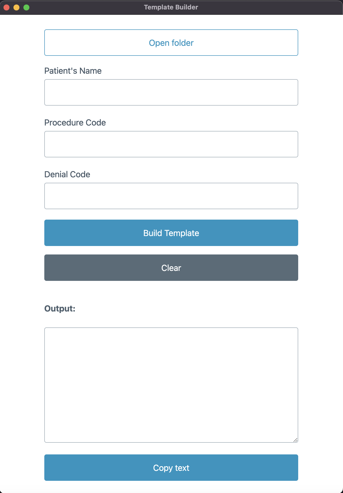

# Template Builder

### Desktop application created for an insurance claim agency team to speed up writing insurance claims by using prebuilt customizable templates. Built with Electron.js both for MacOS and Windows.

Languages and frameworks:

- Electron.js
- JavaScript
- Pico.css
- CSS
- HTML
- Node.js.
- mammoth for extracting text from docx files

